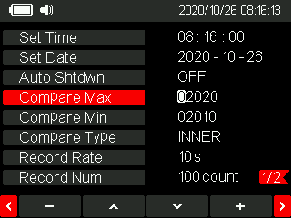

自制可运行在 STM32 中的数字万用表图形界面和实现多页面菜单逻辑，同时实现了图形界面菜单管理，图形界面显示字体字号管理，文字内容显示编码使用 `UTF-8` 所以可以支持多语言显示。

## 显示/复用

虽然这里是万用表界面，但是这里只是以万用表界面作为示例，本质是想说明怎么在单片机中写出一个图形界面，以及在众多功能中，底部菜单显示内容如何切换，以及底部实体硬件按键逻辑如何复用，等等。

## 开发工具

如果你的手上有正点原子 `STM32F407` 探索者开发板，那么该程序直接编译下载至开发板即可运行，会显示出相应的图形界面，探索者开发板具体信息如下。

开发板：正点原子 `STM32F407` 探索者开发板。

单片机：STM32F407VET6, RAM：192KB, Flash：512KB。

编译工具：KEIL5.26-MDK-ARM 集成开发环境。

屏幕驱动芯片：ili9341a 驱动芯片。

## 源码目录

所有绘图，相关字符显示，Logo 图标绘画，以及按键控制，主题切换设计思路，按键复用逻辑的程序实现源码均位于 main/ 目录下，直接点击链接跳转到该目录下即可查看。

对于单片机驱动，只简单实现了屏幕驱动，按键驱动，因为对于 UI 实现有这两个驱动就足够了，如果有必要加上串口驱动用于日志打印。

## 实现样式

在嵌入式领域，图形界面框架 LVGL，TouchGFX，EnWin 都非常好用了，还有没有必要自己去绘制 UI。有必要的，即使是轻量图形界面移植起来也多少要消耗一些资源。或是说你只要一个简单界面，为了一个简单界面去移植 GUI 框架显然大动干戈，所以就可以自己实现。

## 字符工具

用于生成中文、字符、图案、图标点阵，用于字模提取（汉字点阵生成），用于生成单片机显示的中文、图案的点阵（软件已经放置到 Docs/ 目录下了）。

